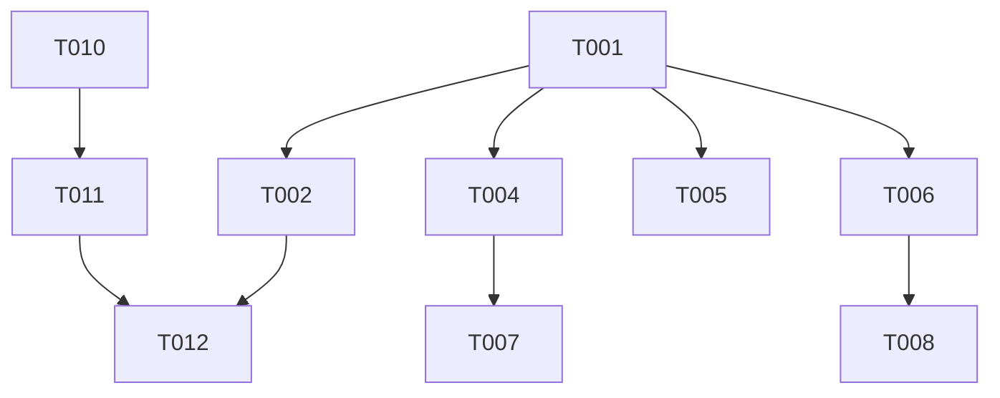

# Tasks: Chatwoot SaaS Rebranding & Localization

**Input**: Design documents from `.agents/#Rebranding/`
**Prerequisites**: plan.md, chatwoot_saas_kurdistan_blueprint.md

## Phase 1: Setup (Shared Infrastructure)

**Purpose**: Project initialization and basic structure

- [X] T001 Verify active worktree is on a clean feature branch

---

## Phase 2: Foundational (Blocking Prerequisites)

**Purpose**: Core infrastructure that MUST be complete before ANY user story can be implemented

*(No blocking foundational code prerequisites for this localization task)*

---

## Phase 3: User Story 1 - White-labeling & Branding (Priority: P1) 🎯 MVP

**Goal**: Ensure Chatwoot visually represents the Kurdish SaaS brand instead of the default blue Chatwoot brand.
**Independent Test**: Build the Vue frontend and verify primary buttons are no longer `#2781F6` and the installation name is used.

### Implementation for User Story 1

- [X] T002 [US1] Change `brand` hex code in `theme/colors.js` to the new custom brand color.
- [X] T003 [US1] Create a brief `deploy-guide.md` documenting the requirement to set `INSTALLATION_NAME` in the `.env` file.

---

## Phase 4: User Story 2 - Kurdish Localization & RTL (Priority: P1)

**Goal**: Add the Sorani/Kurdish (`ku`) language to the backend, frontend, and ensure emails and UI render right-to-left (RTL).
**Independent Test**: Select "Kurdish" in the dashboard profile settings and verify the entire UI switches to RTL. Trigger a password reset and verify the email HTML contains `dir="rtl"`.

### Implementation for User Story 2

- [X] T004 [P] [US2] Copy `config/locales/en.yml` to `config/locales/ku.yml` and replace root key `en:` with `ku:`.
- [X] T005 [P] [US2] Copy `config/locales/devise.en.yml` to `config/locales/devise.ku.yml` and replace root key `en:` with `ku:`.
- [X] T006 [P] [US2] Duplicate the `app/javascript/dashboard/i18n/locale/en` directory to `app/javascript/dashboard/i18n/locale/ku`.
- [X] T007 [US2] Update `config/initializers/languages.rb` to append `ku` (Kurdish) to the `LANGUAGES_CONFIG` hash.
- [X] T008 [US2] Register the `ku` locale imports and export it in `app/javascript/dashboard/i18n/index.js`.
- [X] T009 [US2] Modify `app/views/layouts/mailer/base.liquid` to dynamically inject `dir="rtl"` into the HTML structure when the recipient's locale is `ku` or `ar`.

---

## Phase 5: User Story 3 - SaaS Subscription & Plan Enforcement (Priority: P2)

**Goal**: Since billing is handled manually in cash, create the external automation script that enforces agent limits via the API so accounts don't abuse the system.
**Independent Test**: Run the Cloudflare Worker script locally and verify it successfully hits the Chatwoot API and suspends a test account that exceeds the limit.

### Implementation for User Story 3

- [X] T010 [US3] Create `scripts/cloudflare-worker-plan-enforcer.js` with logic to ping `/api/v1/platform/accounts` and suspend violators.
- [X] T011 [US3] Add instructions to `deploy-guide.md` explaining how to manually onboard customers using the built-in `/super_admin` dashboard.

---

## Phase 6: Polish & Cross-Cutting Concerns

**Goal**: Finalize deployment configurations.

- [X] T012 Update `deploy-guide.md` with Coolify deployment instructions (persistent Redis, Cloudflare R2 for `ACTIVE_STORAGE_SERVICE`, and SendGrid SMTP).

---

## Dependencies

## Parallel Execution Examples

- `T004`, `T005`, and `T006` can be executed simultaneously since they just involve duplicating translation files in isolated directories.
- `T002` (colors) and `T010` (Cloudflare Worker script) are completely isolated and can be built in parallel.

## Implementation Strategy

1. **MVP Scope (Phase 3 & 4):** Focus heavily on the Kurdish localization and RTL email injection. This is the core value proposition of the SaaS in this region.
2. **Operations (Phase 5):** The external Cloudflare worker is necessary for SaaS viability but can be developed outside the main Chatwoot CE application lifecycle.
